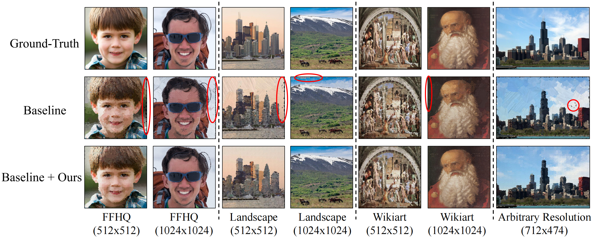
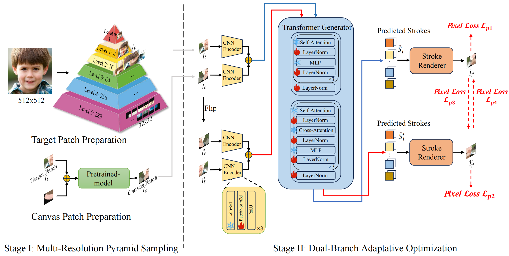
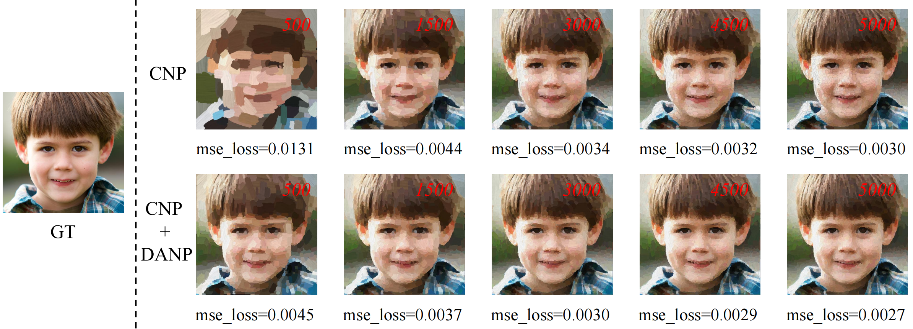

# Domain-Agnostic Neural Oil Painting via Normalization Affine Test-Time Adaptation



## Abstract

Neural oil painting synthesis is to sequentially predict brushstroke color and position, forming an oil painting step by step, which could serve as a painting teacher for education and entertainment. Existing methods usually suffer from degraded generalization for real-world photo inputs due to the training-test distribution gap, often manifesting as stroke-induced artifacts (e.g., over-smoothed textures or inconsistent granularity).

> In an attempt to mitigate this gap, we introduce a **domain-agnostic neural painting (DANP)** framework that aligns model to the test domain. In particular, we focus on updating affine parameters of normalization layers efficiently, while keeping other parameters frozen.

To stabilize adaptation, our framework introduces:  
**(1)** Asymmetric Dual-Branch with mirror augmentation for robust feature alignment via geometric transformations,  
**(2)** Dual-Branch Interaction Loss combining intra-branch reconstruction and inter-branch consistency, and we also involve an empirical optimization strategy to mitigate gradient oscillations in practice.

Experiments on real-world images from diverse domains (e.g., faces, landscapes, and artworks) validate the effectiveness of DANP in resolution-invariant adaptation, decreasing **~11.3% reconstruction error at 512px** and **~20.3% at 1024px** compared to the baseline model. It is worthy noting that our method is compatible with existing methods, e.g., Paint Transformer, and further improves the **~10.3% perceptual quality**.

## Methodology



Given one single input image of 512 × 512, we split it into different levels according to a pyramid hierarchy as a training set. At each level, the resolution of the image gradually increases until the bottom layer generates a boundary feature map of 544 × 544. At each layer, the feature map is divided into 32 × 32 image patches, which are then input into the Pretrained model for further processing.

> During the **Dual-Branch adaptive optimization** process, we adopt a freezing strategy for the pretrained model, freezing all other layers except BatchNorm and LayerNorm during the training process to keep the remaining parameters unchanged. The test dataset obtained in the first stage is divided into two parallel processing routes, one of which horizontally flips the image patch and the current patch, and inputs them in batches into the pretrained model.

##  Run

### 1. Fine-tuning

```bash
cd ~/tta
sh bash.sh
```
### 2. Inference

```bash
cd ~/inference
python inference.py
```

## Results on Various Datasets

### Paintings on FFHQ (Facial Images)

| Target Image | Painting Process | Final Result |
|--------------|-----------------|--------------|
| .png) |  | .png) |
| .png) |  | .png) |
| .png) |  | .png) |

---

### Paintings on Landscapes

| Target Image | Painting Process | Final Result |
|--------------|-----------------|--------------|
| .jpg) |  | .png) |
| .jpg) |  | .png) |
| .jpg) |  | .png) |

---

### Paintings on WikiArt

| Target Image | Painting Process | Final Result |
|--------------|-----------------|--------------|
| .jpg) |  | .png) |
| .jpg) |  | .png) |
| .jpg) |  | .png) |

---

## Comparison of Generated Images with Varying Numbers of Brushstrokes



---


&copy; 2025 DANP Project - Domain-Agnostic Neural Oil Painting Research
